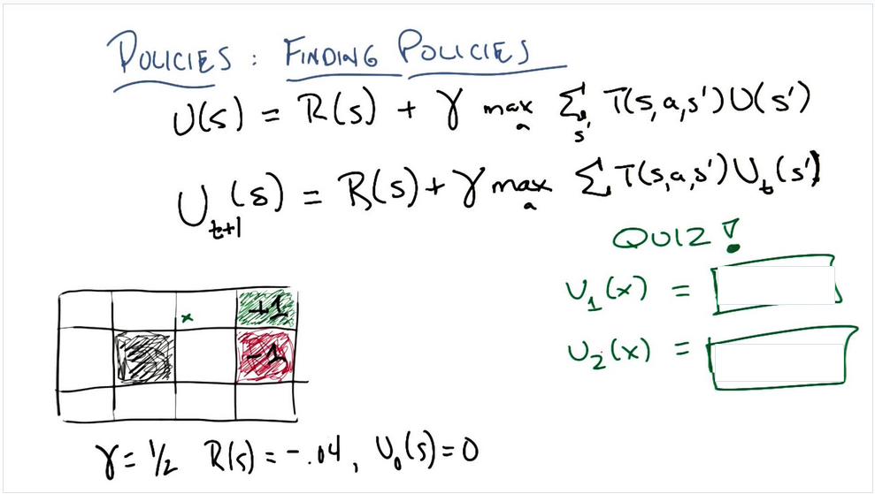
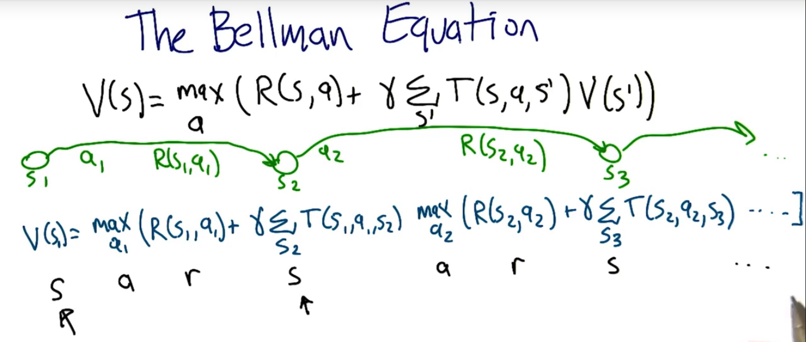
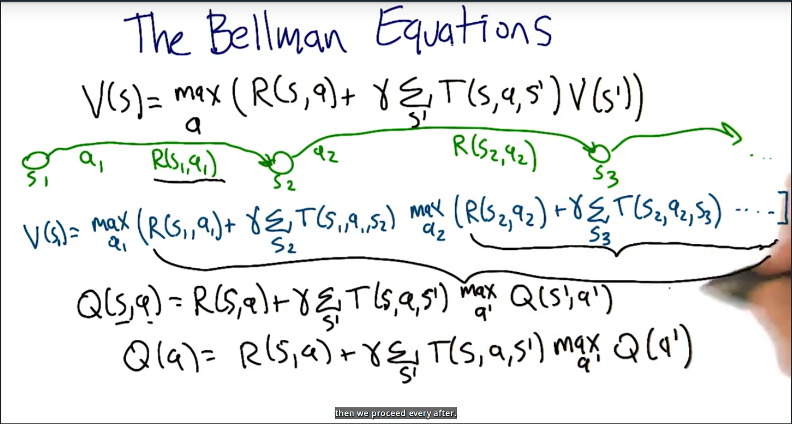
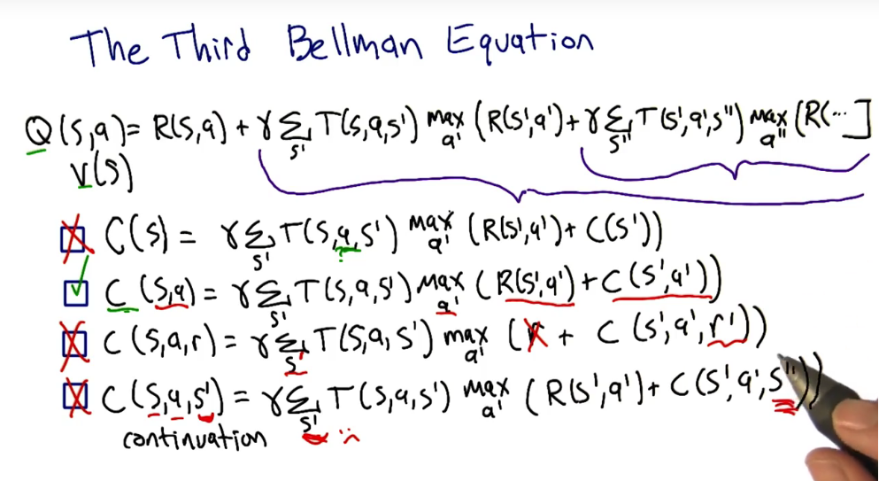
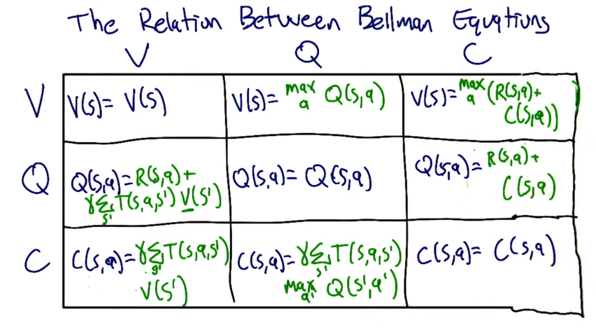

# What is Reinforcement Learning
TBD
# Markov Decision Processes
Markov Decision Processes try to give us a framework, the framework need we describe our problem
with these important concepts:
|Concept | Math present| Describetion |
|---:|:------:|:---|
|States| $S$ | describes the world's state|
|Model|$T(s,a,s^{\prime}) = P(s^{\prime}\|s, a)$| T is Transition Model function it give that the probability that if you were in state s, and you toke action a and you end up transitioning with state s^{\prime}|
|Actions|$A(s)$, A|the actions you can do in the world|
|Reward|R(s), R(s, a), R(s, a, s^{\prime})|Reward function give you some rewards when you were in state s, or you were in state s and toke action a, or you were in state a and toke action a and you end up transitioning at $s^{\prime}$|
|Policy|$\pi(s)=a, \pi^{*} $ | $\pi(s)$ is policy we need to find and it give that when you were in state s and what action you should take in the next step and this policy can help you find the answer or get destination or whatever, and $\pi^{*}$ is the best policy you found in these all possible policies|

States, Model(Transition Model), Actions, Reward they are problem, Policy is the solution.

## Reward function

Try to think about whats the different if your reward function is $R(s) = 2$ and $R(s) = -2$, that mean whatever state you are, you will get 2 or -2 reward, that the simplest reward function. 
$R(2) = 2$ will encourage you to stay in the world insteal of getting terminal state.
$R(2) = 2$ will keep you want to leave away from the world.

## Stationary Preferences

if you use s util function to compare two sequence of state like:
$U_{1}(s_{0}, s_{1}, s_{2}, s_{3}, s_{4}, ...)$
$U_{2}(s_{0}, s_{1}^{\prime}, s_{2}^{\prime}, s_{3}^{\prime}, s_{4}^{\prime}, ...)$
and you get the conclusion that $U_{1} > U_{2}$
then for these two sequence of state:
$U_{1}(s_{1}, s_{2}, s_{3}, s_{4}, ...)$
$U_{2}(s_{1}^{\prime}, s_{2}^{\prime}, s_{3}^{\prime}, s_{4}^{\prime}, ...)$
you will also think:
$U_2 > U_3$
that is the stationary preferences

## Sequences of Reward

if one kind of U function like this:
$U(s_{0}, s_{1}, s_{2}, s_{3}, ...) = \sum_{t=0}^{\infin} R(s_t) = \infin$
that's true because the reward is always positive.
this is a typical infinite world situation, if your U function like this, each step of your decision making will be nothing.
but if your U function like this:
$U(s_{0}, s_{1}, s_{2}, s_{3}, ...) = \sum_{t=0}^{\infin} \gamma^{t}R(t)$
the $\gamma^{t}$ will change the thing to a situation that you still in a infinite world but you will reach a point that whatever you choose to go, you never get the bound of the world.
also you will get a equition:
$U <= \sum_{t = 0}^{\infin}\gamma^{t}R_{max} = \frac{R_{max}}{1 - \gamma}$
because:
$x = (\gamma^{0} + \gamma^{1} + \gamma^{2} + \gamma^{3} + ...)$
$x =\gamma^{0} + \gamma \cdot (\gamma^{0} + \gamma^{1} + \gamma^{2} + ...)$
$x = \gamma^{0} + \gamma \cdot x$
$x = \frac{\gamma^{0}}{1 - \gamma}$
so:
$ \sum_{t = 0}^{\infin}\gamma^{t}R_{max} = \frac{R_{max}}{1 - \gamma} =  \frac{\gamma^{0}}{1 - \gamma} \cdot R_{max}$

## Policies

How we use mathematic way to express policy function:
$\pi^{*} = \underset{\pi}{argmax} E[\sum_{t=0}^{\infin}\gamma^{t}R(s_{t})|\pi]$
that means the optimal policy is that if we follow this policy, we can get a sequences of states and it's corresponding rewards sum is max. Also the rewards is discounted by $\gamma$ factor.

Next how to express the utility of s:
$U^{\pi}(s) = E[\sum_{t=0}^{\infin}\gamma^{t}R(s_{t})|\pi, s_{0} = s]$
so the utility of s is the long term reward of current state reward plus all the other rewards follow the policy $\pi$ which is the rewards from s on to the infinite state.

Note: R(s) is immediately feedback/reward U(s) is long term feedback/reward

if we have utility we have new policy function:
$\pi^{*}(s) = \underset{a}{argmax}\sum_{s^{\prime}}T(s,a,s^{\prime})U(s^{\prime})$
Now the utility is always follow the optimal policy:
$U(s) = U^{\pi^{*}}(s)$

It's means the optimal policy for every state, return the action a that maximizes my expected utility. This is recursive function because we use optimal policy $\pi^{*}$ to calculate itself, later we will make it possible.

## Bellman Equation
Now we introduce bellman equation:
$U(s) = R(s) + \gamma \underset{a}{max}\sum_{s^{\prime}}T(s,a,s^{\prime})U(s^{\prime})$
We ganna use $U(s^{\prime})$ to calculate $U(s)$, the utility equals immediately reward at state s plus discounted utility that use the action a which maximizes the long term rewards from s on.

## Finding Policies 1

Right now we have Bellman equation, and we don't know how to solve U(s), the Value Iteration method could be a way to solve it but I don't know why, so let do a quiz:

What we need to know is, all the state initial utility is ZERO except green grid and red grid its One and negative One:
$U_{1}(x) = R(x) + \gamma \underset{a}{max}
\begin{cases}
    \sum_{a_{up}}T(x, a_{up}, x^{up})U_{0}(x^{up}) \\
    \sum_{a_{down}}T(x, a_{down}, x^{down})U_{0}(x^{down}) \\
    \sum_{a_{left}}T(x, a_{left}, x^{left})U_{0}(x^{left}) \\
    \sum_{a_{right}}T(x, a_{right}, x^{right})U_{0}(x^{right})
\end{cases}$
then we choose the max one:
$U_{1}(x) = -0.04 + 0.5 \times \underset{a}{max}
\begin{cases}
    0.8\times0+0.1\times1+0.1\times0 = 0.1 \\
    0.8\times0+0.1\times1+0.1\times0 = 0.1 \\
    0.8\times0+0.1\times0+0.1\times0 = 0 \\
    0.8\times1+0.1\times0+0.1\times0 = 0.8
\end{cases} = -0.04 + 0.5\times(0.8\times1+0.1\times0+0.1\times0) = 0.36$

This was because we always want max value so we first choose to go right to red grid at same time we have 0.2 probability to go wrong direction to go down and go up.
When we go up and down, we'll get ZERO utility because initial utility is ZERO. Next we use $U_{1}(x)$ to solve $U_{2}(x)$:
$U_{2}(x) = R(x) + \gamma \underset{a}{max}
\begin{cases}
    \sum_{a_{up}}T(x, a_{up}, x^{up})U_{1}(\colorbox{green}x) \\
    \sum_{a_{down}}T(x, a_{down}, x^{down})U_{1}(x^{down}) \\
    \sum_{a_{left}}T(x, a_{left}, x^{left})U_{1}(x^{left}) \\
    \sum_{a_{right}}T(x, a_{right}, x^{right})U_{1}(x^{right})
\end{cases}$
as you see we need to get $U_{1}(x^{up|down|left|right})$, we can fellow the function $U_{1}(x)$ way to get it, so:
$U_{1}(x^{up})$ is out of grid so we assume $U_1{x^{up}} = 0$.

$U_{1}(x^{down}) = -0.04 + 0.5 \times \underset{a}{max}
\begin{cases}
    0.8\times0+0.1\times0+0.1\times-1 = -0.1 \\
    0.8\times0+0.1\times0+0.1\times-1 = -0.1 \\
    0.8\times0+0.1\times0+0.1\times0 = 0 \\
    0.8\times-1+0.1\times0+0.1\times0 = -0.8
\end{cases}$
$ = -0.04 + 0.5\times(0.8\times0+0.1\times0+0.1\times0) = -0.04$

$U_{1}(x^{left}) = -0.04 + 0.5 \times \underset{a}{max}
\begin{cases}
    0.8\times0+0.1\times0+0.1\times0 = 0 \\
    0.8\times0+0.1\times0+0.1\times0 = 0 \\
    0.8\times0+0.1\times0+0.1\times0 = 0 \\
    0.8\times0+0.1\times0+0.1\times0 = 0
\end{cases}$
$ = -0.04 + 0.5\times(0.8\times0+0.1\times0+0.1\times0) = -0.04$

$U_{1}(x^{right})$ is already given with 1 so $U_{1}(x^{right}) = 1$

now let's use above result to get $U_{2}(x)$:
$U_{2}(x) = -0.04 + 0.5 \times \underset{a}{max}
\begin{cases}
0.8 \times 0.36 + 0.1 \times -0.04 + 0.1 \times 1 =  0.384 \\
0.8 \times -0.04 + 0.1 \times -0.04 + 0.1 \times 1 =  0.064 \\
0.8 \times -0.04 + 0.1 \times 0.36 + 0.1 \times -0.04 =  0 \\
0.8 \times 1 + 0.1 \times 0.36 + 0.1 \times -0.04 = 0.832
\end{cases}$
$= -0.04 + 0.5\times(0.8 \times 1 + 0.1 \times 0.36 + 0.1 \times -0.04) = 0.376$

$U_{2}(x) = -0.04 + 0.5(0.8 \times 1 + 0.1 \times 0.36 + 0.1 \times -0.04) = 0.376$

Now we get $U_{2}(x)$, the most interesting thing is I found current Utility of state is similar to anergy spreading from center on, in our situation, the anergy center is $x^{right}$ who's Utility is 1, other utility of state is like under anergy spreading and their value is smaller than center, the smallest one is most faraway one:

## Finding Policies 2

So far we learned about getting Utility, and before we have been teached that the policy equation $\pi^{*}(s) = a$ need the core components U(s) to solve it, so next we will use the important result to find policy.

First we need to introduce the difference presentation of Bellman Equation
Let's see this one:
$V(s) = \underset{a}{max}(R(s,a) + \gamma \sum_{s^{\prime}}T(s,a,s^{\prime})V(s^{\prime}))$
You may found the difference is we use V to express Value instead of U to express Utility, we move ahead the $\underset{a}{max}$ to express take maximize action, we use $R(s,a)$ to express taking a action in a state and get reward instead of get reward when you get a state.

If we expanded the equation, we can understand the equation by this way:

Semantic description is :
We start at a specific state s, and we take a action a, and we get the reward of taking action a in state s, and this action lands the new state, and we recursively execute the process.

Let's see another one:

If we use a difference view, we may found that the V equation have another recursive sub-sequence from first R(s,a) on to next R(s,a), so we can have another equation:
$Q(s,a) = R(s,a) + \gamma\sum_{s^{\prime}}T(s,a,s^{\prime})\underset{a^{\prime}}{max}Q(s^{\prime}, a^{\prime})$
Semantic description is :
We start at some state s and we take action a, and start to process every after, this is we get a reward of taking action a at state s, and this action lands we transform to state $s^{\prime}$ and we recursively execute the process.

Let's see another one:

When we get Q equation, we again may found another recursive sub-sequence form first $\gamma$ on to next $\gamma$, so we can have another equation:
$C(s,a) = \gamma\sum_{s^{\prime}}\underset{a^{\prime}}{max}(R(s^{\prime}, a^{\prime})+ C(s^{\prime}, a^{\prime}))$

With this V function and Q function and C function, we can use one of them to express another one of them:
For example:
$V(s) = \underset{a}{max}(Q(s,a))$
$Q(s, a) = R(s,a) + \gamma\sum_{s^{\prime}}T(s, a, s^{\prime})V(s^{\prime})$
$C(s,a) = \gamma\sum_{s^{prime}}T(s,a,s^{\prime})V(s^{\prime})$
I guess you can find more like above those.

These three function indeed have difference meaning in after introduction, let me refer it out slowly.

