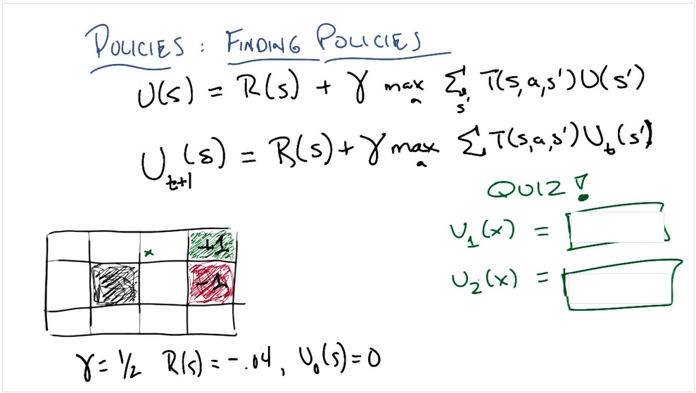

# What is Reinforcement Learning
  
TBD
# Markov Decision Processes
  
Markov Decision Processes try to give us a framework, the framework need we describe our problem
with these important concepts:
|Concept | Math present| Describetion |
|---:|:------:|:---|
|States|  | describes the world's state|
|Model|| T is Transition Model function it give that the probability that if you were in state s, and you toke action a and you end up transitioning with state s^{\prime}|
|Actions|, A|the actions you can do in the world|
|Reward|R(s), R(s, a), R(s, a, s^{\prime})|Reward function give you some rewards when you were in state s, or you were in state s and toke action a, or you were in state a and toke action a and you end up transitioning at |
|Policy| |  is policy we need to find and it give that when you were in state s and what action you should take in the next step and this policy can help you find the answer or get destination or whatever, and  is the best policy you found in these all possible policies|
  
States, Model(Transition Model), Actions, Reward they are problem, Policy is the solution.
  
## Reward function
  
  
Try to think about whats the different if your reward function is  and , that mean whatever state you are, you will get 2 or -2 reward, that the simplest reward function. 
 will encourage you to stay in the world insteal of getting terminal state.
 will keep you want to leave away from the world.
  
## Stationary Preferences
  
  
if you use s util function to compare two sequence of state like:

and you get the conclusion that 
then for these two sequence of state:

you will also think:

that is the stationary preferences
  
## Sequences of Reward
  
  
if one kind of U function like this:

that's true because the reward is always positive.
this is a typical infinite world situation, if your U function like this, each step of your decision making will be nothing.
but if your U function like this:

the  will change the thing to a situation that you still in a infinite world but you will reach a point that whatever you choose to go, you never get the bound of the world.
also you will get a equition:

because:

so:

  
  
## Policies
  
  
How we use mathematic way to express policy function:

that means the optimal policy is that if we follow this policy, we can get a sequences of states and it's corresponding rewards sum is max. Also the rewards is discounted by  factor.
  
Next how to express the utility of s:

so the utility of s is the long term reward of current state reward plus all the other rewards follow the policy  which is the rewards from s on to the infinite state.
  
Note: R(s) is immediately feedback/reward U(s) is long term feedback/reward
  
if we have utility we have new policy function:

Now the utility is always follow the optimal policy:

  
It's means the optimal policy for every state, return the action a that maximizes my expected utility. This is recursive function because we use optimal policy  to calculate itself, later we will make it possible.
  
## Bellman Equation
  
Now we introduce bellman equation:

We ganna use  to calculate , the utility equals immediately reward at state s plus discounted utility that use the action a which maximizes the long term rewards from s on.
  
## Finding Policies 1
  
  
Right now we have Bellman equation, and we don't know how to solve U(s), the Value Iteration method could be a way to solve it but I don't know why, so let do a quiz:

What we need to know is, all the state initial utility is ZERO except green grid and red grid its One and negative One:

then we choose the max one:

  
This was because we always want max value so we first choose to go right to red grid at same time we have 0.2 probability to go wrong direction to go down and go up.
When we go up and down, we'll get ZERO utility because initial utility is ZERO. Next we use  to solve :

as you see we need to get , we can fellow the function  way to get it, so:
 is out of grid so we assume .
  

  

  
 is already given with 1 so 
  
now let's use above result to get :

  
  

  
Now we get , the most interesting thing is I found current Utility of state is similar to anergy spreading from center on, in our situation, the anergy center is  who's Utility is 1, other utility of state is like under anergy spreading and their value is smaller than center, the smallest one is most faraway one:

  
## Finding Policies 2
  
  
So far we learned about getting Utility, and before we have been informed that the policy equation  need the core components U(s) to solve it, so next we will use the important result to find policy.
  
  
  